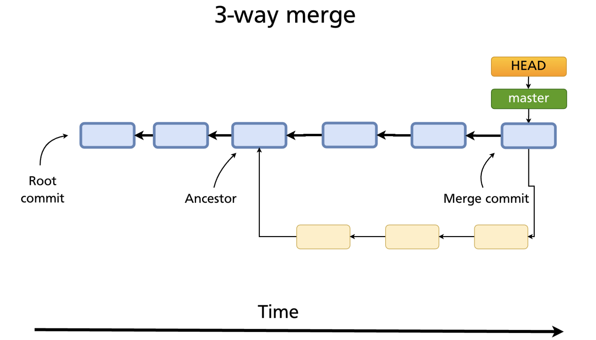
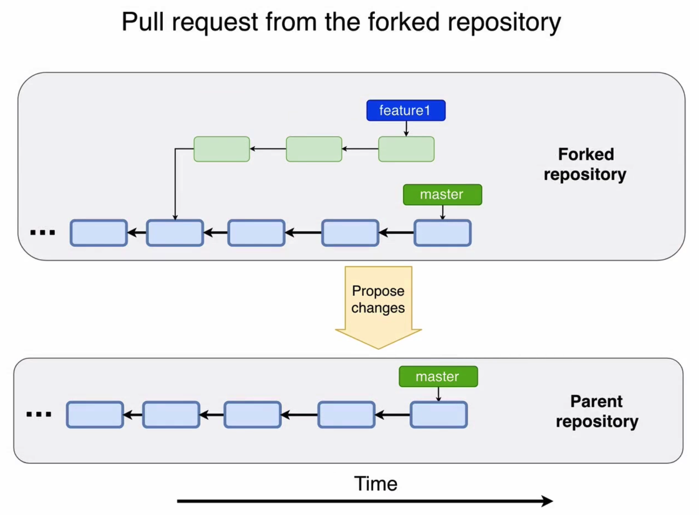

## About The Project

- The Complete Git Guide: Understand and Master Git and GitHub
- Complete Git and GitHub guide (23 HOURS) - Master all Git features: commits, branches, merging, rebasing and squashing
- Tutorial for hidash (testing)
- [Bogdan Stashchuk GitHub](https://github.com/bstashchuk)
- [Bogdan Stashchuk Website](stashchuk.com)

&nbsp;

<details>
  <summary>Table of Contents</summary>
  <ol>
  <li><a href="#git-vs-github">Git vs GitHub</a></li>
  <li><a href="#how-git-works-under-the-hood">How Git Works Under The Hood</a></li>
  <li><a href="#git-hash-object">git hash-object</a></li>
  <li><a href="#git-cat-file">git cat-file</a></li>
  <li><a href="#git-object">Git Object</a></li>
  <li><a href="#git-mktree">git mktree</a></li>
  <li><a href="#working-directory-staging-area-index--git-repository">Working directory, staging area (index) & Git repository</a></li>
  <li><a href="#branch">Branch</a></li>
  <li><a href="#head-detached-head">HEAD and Detached HEAD</a></li>
  <li><a href="#merging-branches">Merging Branches</a></li>
  <li><a href="#interaction-with-remote-git-repository">Interaction With Remote Git Repository</a></li>
  <li><a href="#commit-under-another-author">Commit Under Another Author</a></li>
  <li><a href="#create-remote-branch-base-on-local-branch">Create Remote Branch Base On Local Branch</a></li>
  <li><a href="#forks-and-contribution-to-the-public-repositories">Forks and Contribution To The Public Repositories</a></li>
  <li><a href="#git-tags">Git Tags</a></li>
  <li><a href="#rebase">Rebase</a></li>
  </ol>
</details>

&nbsp;

## Notes

### Git vs GitHub

- Distributed version-control system vs Repository hosting service
- A distributed version control system (DVCS) brings a local copy of the complete repository to every team member’s computer, so they can commit, branch, and merge locally. The server doesn’t have to store a physical file for each branch — it just needs the differences between each commit.

&nbsp;

### How Git Works Under The Hood

- Git Object Types
  - <b>Blob:</b> Files of any type
  - <b>Tree:</b> Directories
  - <b>Commit:</b> Version
  - <b>Annotated Tag:
    - <b>A lightweight tag</b> is very much like a branch that doesn’t change — it’s just a pointer to a specific commit.
    - <b>Annotated tags</b>, however, are stored as full objects in the Git database.

&nbsp;

- Git will not delete any of the previously created files or folders in the Git repository immediately even after user has deleted files and make a commit. They are removed in some time by garbage collector.

&nbsp;

### git hash-object

- Git uses SHA1 hash algorithm.
  - You can see that SHA1 is used because file folder name + filename exactly 40 hex characters long (Base 16).
  - [hash-function-transition: Migrate Git from SHA-1 to a stronger hash function.](https://git-scm.com/docs/hash-function-transition/)
  - [How to assign a Git SHA1's to a file without Git?](https://stackoverflow.com/questions/552659/how-to-assign-a-git-sha1s-to-a-file-without-git/552725#552725)

```sh
echo Hello, Git | git hash-object --stdin
echo Hello, Git | git hash-object --stdin -w

echo Hello, Git | shasum    # 0a2b198f595e55060dec9f0e196c10de86f2ca1c
echo -n Hello, Git | shasum # c9d5d04925b93d2fb99c73ab2b5869bde7405ca4
```

- What is the difference between - and -- ?
  - Usually - is used with one-letter options
  - Whereas -- with word options

&nbsp;

- Folder name + file name = hash of the file
- Hashs are one way function
- Output will always be the same when hashing same input

&nbsp;

- How many files Git can store in the same repository?
  - SHA1 hash is 40 Hex characters. Each Hex character is represented with 4 binary characters. Each binary character is either 0 or 1. That's why length of the SHA1 hash in binary characters is 40\*4=160. That's why total qty of permutations is 2^160
  - Or in another way,
    - 40 Hex characters
    - 16 possible characters on each place
    - Qty of possible permutations 16^40 = 2^4^40=2^160

&nbsp;

- What is the chance of producing same hash for different files (hash collision)?
- Probability of the same speficic SHA1 hash
  - 1/2<sup>160</sup> \* 1/2<sup>160</sup> = 1/2<sup>320</sup> which is 4.68e-97
- Probability of any same SHA1 hash on any pair of N files.
  - 1 - ((2<sup>160</sup> - 1)! / ((2<sup>160</sup> - 1)! \* (2<sup>160 \* (N-1)</sup>)))
  - N=2 6.84e-49
  - N=3 2.05e-48

> Hash Collision Probability is very, very low and it will almost never happen in the repository. But if it happens, in some cases Git will not tell you about that but pointers to blobs will be incorrect (if for example two blobs have same SHA1 hash). In some cases Git will tell you that repository is corrupt (if for example tree object and blob object have same SHA1 hash).

- [How would Git handle a SHA-1 collision on a blob?](https://stackoverflow.com/questions/9392365/how-would-git-handle-a-sha-1-collision-on-a-blob/9392525)
- [Birthday Problem](https://en.wikipedia.org/wiki/Birthday_problem)

&nbsp;

### git cat-file

| flag |  git cat-file options  |
| :--: | :--------------------: |
|  -p  | Contents of the object |
|  -s  |   Size of the object   |
|  -t  |   Type of the object   |

```sh
git cat-file -flag b7aec520dec0a7516c18eb4c68b64ae1eb9b5a5e
```

- By removing some characters it would still giving me the same results up to four characters.
  - As long Git is able to locate an uniques object using characters you supply it will give you result. It means there is no need to enter full SHA1 hash.

&nbsp;

### Git Object

- Content + Object Type + Object Length = Hash
- Hello, Git | blob | 11 | \0 (Delimiter)
- Escaped character \0 is also counted as character.
- \0 is null

```sh
echo 'blob 11\0Hello, Git' | shasum # b7aec520dec0a7516c18eb4c68b64ae1eb9b5a5e  -
echo -e 'blob 11\0Hello, Git' # blob 11Hello, Git
```

- [echo flags](https://linuxcommand.org/lc3_man_pages/echoh.html)
- [Inline Data Format](https://git-scm.com/docs/git-fast-import#Documentation/git-fast-import.txt-Inlinedataformat)
  - 100664: A normal (not-executable) group-writeable file.

&nbsp;

### git mktree

- Hash of the new tree Git object

```sh
find .git/objects -type f
# .git/objects/.DS_Store
# .git/objects/b7/aec520dec0a7516c18eb4c68b64ae1eb9b5a5e
pico temp-tree.txt
100644 blob b7aec520dec0a7516c18eb4c68b64ae1eb9b5a5e	file1.txt
cat temp-tree.txt | git mktree
# 0c047ef0c36b4d539f2c4cfa1676f26dc60ad724
git cat-file -p 0c04
# 100644 blob b7aec520dec0a7516c18eb4c68b64ae1eb9b5a5e	file1.txt
```

&nbsp;

### Working directory, staging area (index) & Git repository

- Commit (Root directory) -> Tree -> Blobs
- Often <code>main</code> branch is "production" version, and <code>release</code> is "staging" version of the project.
- Every file in Git may have one of four tracking statuses:
  - Untracked
  - Modified
  - Staged
  - Unmodified

```sh
git read-tree 0c04      # Git Repo
git ls-files -s         # Staging Area
git checkout-index -a   # Working Directory
```

- How many folders could be created for objects?
  - Each folder name is 2 characters
  - 1 character is 16 hex
  - 16 \* 16 = 256 folders

```sh
git cat-file -t bd63    # Commit Object
git rm --cached <file>  # Unstage File
```

&nbsp;

### Branch

- Branch is just <u>text reference</u> to the commit.
- Default branch is main.
- Multiple branches can exist in the same repository.
- Pointers for all branches are located in <b>.git/refs/heads folder</b>.
- Current branch tracks new commits.
- Branch pointer moves automatically after every new commit.
- Change branch <b>git checkout &lt;branch&gt;</b>

```sh
git branch                    # List all local branches
git branch <name>             # Create new branch
git branch -d <name>          # Delete specific merged branch
git branch -D <name>          # Delete specific non-merged branch
git branch -m <old> <new>     # Rename specific branch
git checkout <name>           # Checkout specific branch
git checkout -b <branch name> # Creating a branch with checkout
```

&nbsp;

### HEAD & Detached HEAD

- HEAD is <u>reference</u> to the currently checked-out branch or commit.
- HEAD is locally significant.
- Pointer is located in the <b>.git/HEAD</b> file.
- Deafult pointer is <b>ref: refs/heads/main</b>.
- Change reference to specific branch <b>git checkout &lt;branch&gt;</b>.
- Change reference to specific commit <b>git checkout &lt;sha1&gt;</b>.
- Ideally, HEAD is pointing at branch latest commit. (Refer to Detach HEAD state)

---

- Commits made in <b>detached HEAD</b> state will be garbage collected.
- Useful to explore and experiment with specific commit.
- User can also create new branch and merge later.

&nbsp;

### Merging Branches

- [merge-ort: a new merge strategy](https://github.blog/2021-08-16-highlights-from-git-2-33/)

&nbsp;

- Fast-forward merge
  - Is possible when there are no further commits in the receiving branch after the commit where feature branch was created.
  - e.g. main branch will point at feature branch in the diagram below.
  - After merging: <code>git branch -d feature-branch</code>
  - No merge conflict.


&nbsp;

- Merging process
  - Create new feature branch from the main branch.
  - Make changes in the new branch and commit them.
  - Checkout main branch (receiving branch).
  - Merge feature branch to the current receiving branch.
  - <code>git merge &lt;feature-branch&gt;</code>

&nbsp;

- 3-way merge
  - Git will create a new commit to merge ancestor, receiving branch and feature branch.
  - Merge commit will have 2 parents.
  - When the feature branch is deleted, the chain of commits under it still remains as merge commit is still linked to it.
  - Which means all history in both chain of branches are preserved.
  - There may be merge conflict.



&nbsp;

- Merging process
  - Create new feature branch from the main branch.
  - Make changes in the new branch and commit them.
  - Switch back to main branch and commit there.
  - Merge feature branch to the current receiving branch.
  - <code>git merge &lt;feature-branch&gt;</code>

&nbsp;

### Interaction With Remote Git Repository


- <b>Example of fetch: </b>Let's suppose that new branch was created in the Remote repository. After <code>git fetch</code>, same branch will be created in your local Git repository becaus branch is just text file in the .git/refs/heads.
- <b>Example of pull: </b>
  - Clone remote repository.
  - Checkout <code>main</code> branch locally.
  - Make changes and commit them in <code>main</code> branch of remote repository.
  - After <code>git pull</code>, Git will fetch remote changes locally.
  - After fetching, Git will merge remote <code>main</code> branch into local <code>main</code> branch.
  - Staging area (index) and working directory will be automatically updated after merge.
- <code>git pull</code> updates only single local present checked out branch.

```sh
git remote -v           # Shows URLs of remote repositories
git branch -r           # Shows all branches on remote
git branch -a           # Shows all branches both remote and local
git branch -vv          # Shows tracking branch
git remote show origin  # Show more info
git remote prune origin # Git will prompts stale
```

- Git pull is a 2 step process: <code>git fetch</code> & <code>git merge FETCH_HEAD</code>
- During <code>git pull</code>, Git will first execute <code>git fetch</code>. After fetching it will update .git/FETCH_HEAD list and first branch in this list will be currently checked out branch. Finally Git executes <code>git merge FETCH_HEAD</code> command that finds first branch in .git/FETCH_HEAD list without "not-for-merge" tag and merges it into local tracking currently checked out branch.

&nbsp;

### Commit Under Another Author

- Local settings will override global Git settings. Set user.name and user.email applies only locally for current repository.

```sh
git config user.name "<username>"
git config user.email "<email>"
```

&nbsp;

### Create Remote Branch Base On Local Branch

- [Why do I have to "git push --set-upstream origin <branch>"?](https://stackoverflow.com/questions/37770467/why-do-i-have-to-git-push-set-upstream-origin-branch)
- [Why do I need to explicitly push a new branch?](https://stackoverflow.com/questions/17096311/why-do-i-need-to-explicitly-push-a-new-branch/17096880#17096880)

```sh
git push --set-upstream origin <new-branch> # OR
git push -v -u orign feature-2              # flag v is verbose
git remote prune origin # Deletes stale references associated with <name>
git show-ref            # Show both remote and local references
```

&nbsp;

### Forks and Contribution To The Public Repositories

- [Definition of "downstream" and "upstream"](https://stackoverflow.com/questions/2739376/definition-of-downstream-and-upstream)
- [What is a tracking branch?](https://stackoverflow.com/questions/4693588/what-is-a-tracking-branch)




> <b>Aayush:</b> Who is responsible for solving merge conflicts? Who is responsible for solving merge conflicts? The manager who is reviewing the pull request, or the developer who has made the pull request? Also, is there a way that prevents/reduces the possibility of conflicts when a developer creates a pull request?

> <b>Bogdan:</b> Developers are usually responsible for that. If you want to reduce possibilities of conflicts - don't work for a long time on specific feature. But if you work long, you could periodically apply changes from main branch (master or release) to you feature branch by making for example rebasing of your feature branch on top of main branch.

> <b>Aayush:</b> So, before merging any feature branch to the master branch, the developer should pull and merge the master branch into the feature branch so that it is in sync with the master branch, and then push the feature branch to remote and create a pull request?

> <b>Bogdan:</b> Exactly

&nbsp;

### Git Tags

- Useful for Git <code>release</code> versions.
- Tag is a static text pointer to specific commit.


- <b>Continuous Integration (CI)/ Continuous Development (CD)</b>
- <b>Staging (release)</b>
  - primarily for testing
  - usually for internal use
  - merging is performed frequently
  - different feature branches are merged into release branch
  - multiple people may have merge rights
- <b>Production (main)</b>
  - for stable production service
  - for customers
  - merging happens each 2 weeks or 1 month
  - usually only release branch is merged into main branch
  - only few people have merge rights

---

- Semantic Versioning: Major.Minor.Patch (v5.2.4)
  - [semver](https://semver.org/)
- Lightweight: stored in the <code>.git/refs/tags</code>
  - Cannot git push tag to remote
  - [<code>git push origin <tag_name></code>](https://stackoverflow.com/questions/5195859/how-do-you-push-a-tag-to-a-remote-repository-using-git/5195913#5195913)
- Annotated:
  - stored in the <code>.git/refs/tags</code>
  - is also stored in the <code>.git/objects</code>
  - stores tag message
  - stores tag author and data

```sh
git tag v1.0.0
git show v1.0.0
git tag -v v1.0.0 # For annotated tag to show details
git tag -a v1.0.0 -m "Tag Message"

# Setup for git lg
git config --global alias.lg "log --color --graph --pretty=format:'%Cred%h%Creset -%C(yellow)%d%Creset %s %Cgreen(%cr) %C(bold blue)<%an>%Creset' --abbrev-commit"
```

- When you are pushing tags, commits are not pushed. You need to use "git push" to push commits to remote.

&nbsp;

### Rebase

- Rebasing is a destructive operation
- Rewrites history
- History becomes linear
- Doesn't keep entire history of all commits
- Commit will only have single parent


- Merging of the feature branch into base branch using rebasing is two-step process.

```sh
git checkout <branch>
git rebase main         # Rebase <branch> on top of the <base branch>
git checkout main
git merge <branch>      # Fast forward merge will be used
git log --graph
```

> <b>Émerson: </b> What are the advantages of use git rebase?

> <b>Bogdan: </b> The best example of usage of rebasing is periodic rebasing of your feature branch you are currently working on on top of the main branch in order to stay up-to-date with all changes in the main branch and to avoid creation of the multiple merge commits. But it is assumed that nobody else works on dev of the same feature branch.

> With rebasing timestamps of commits will be very shifted and older commits may appear in history as newer commits. That's why honestly in the large projects rebasing is not used so often because correct history is more important than linear history.

&nbsp;
